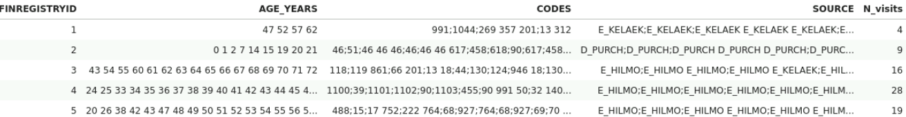

# RNN (pytorch) model and preprocessing of Finregistry data

## Preprocessing

The code which was written with Jupyter notebook in the virtual machine, here is shared both as executable .py files and more readable .md files 

### 0_additional_longitudinal_features

Here longitudinal features are processed from newly received registers (which were previously not included in “detailed longitudinal” file (a file combining data from multiple registers (Hilmo, Avohilmo, Kela purchases, Kela reimburesements, cancer, causes of death))).


1. Infectious diseases
register is based on disease notifications from medical doctors and laboratories. In our study we have used information about microbes which caused an infectious disease. A period covered was from 1994 until the predictive interval. In total there were 170 unique codes.   
2. Socioeconomic status
was based on information on the person's main activity, occupation, professional status and industry. Eight different socioeconomic status categories (codes) were used: lower-level employees, manual workers, upper-level employees, self-employed, students, pensioners, others, and unknown. For individuals for whom the data was available on average socioeconomic status changed 3.4 times. For persons aged 0-15 socioeconomic status was based on a socioeconomic status of the reference person of the household-dwelling. Socio-economic status was available from 1970. 
3. Occupation
data was available from the year 1995 and each occupation was coded hierarchically as a 5 symbol code resulting in 1277 different occupations. For our purposes lower level of detail was sufficient and we retained only first symbol of each code, resulting in 11 occupation categories: service and sales workers, professionals, technicians and associate professionals, craft and related trades workers, plant and machine operators, and assemblers, elementary occupations, clerical and support workers, skilled agricultural, forestry and fishery workers, managers, armed forces, unknown.
4. Education
level and education field were used. Education level is ordered from the lowest to the highest, ranging from secondary to doctoral level education (13 categories in total). Education field classification contains a hierarchical 3-4 symbol codes signifying the education area from the broad (first symbol) to the more detailed (further symbols). In total 100 unique education level codes were used. Education information was available from 1970.
5. Geographic information.
Finland has 309 municipalities (2021) and in this study the geographical location of the individuals was based on the municipality. The geographical information was available from 1964 onwards and to account for changes in municipality definitions (area changes, new municipalities appearing and old disappearing) throughout this follow-up period, the location information was harmonised based on 309 municipalities as defined in 2021. In the models this information was used longitudinally as individuals for whom the data was available changed the municipality in which they lived on average 2.1 times. As geographic information was available only for index individuals, for individuals born on and after 2010 their mothers’ geographic information was used.

Geographic information as available only for index individuals, thus not available for individuals born after January 1st, 2010. For those individuals we have replaced missing geographic information with the geographic information of their mothers.  
Mothers' IDs for children born after 2010 was taken from DVV relatives register. Then mothers longitudinal geographic information starting from the year the child was born was used to replace missing child’s geographic information.


### 1_combine_datas

This script combines data from three sources: endpoint longitudinal file, detailed longitudinal file, and new longitudinal features file (which is derived from new registers not previously included in detailed longitudinal file (see 0_additional_longitudinal_features)). Before running this script, all longitudinal files were split to smaller files each containing data for 300k IDs. The script can be run in parallel using shell commands:

```console
set -x
for num in $(seq -w 01 24); do
	INDEX=$(echo $num | sed 's/^0*//')
	python3 1_combine_datas.py --loop_index $INDEX &
	if (( $INDEX % 5 == 0 )); then sleep 110m; fi
done
```

(a single process uses up to 33G of memory)

Locations for already split files: 
detiled longitudinal: '/data/processed_data/endpointer/supporting_files/main/',
endpoint longitudinal: '/data/project_avabalas/RNN/preprocessing/',
new registers: '/data/projects/project_avabalas/RNN/preprocessing_new/'

In pre-processing folder shell scripts for splitting detailed longitudinal and endpoint longitudinal are included in files split_detailed_longitudinal.sh and split_endpoint_longitudinal.sh


### 2_dict_codes

Here a code dictionary is constructed from all the codes in combined longitudinal files. In addition a total number of code occurrences is counted as well as a number of IDs which have a code occurring at least once in their longitudinal history. 

### 3_delete_rare_redundant_codes

Additionally omitted endpoints/ other codes: 

Endpoint longitudinal file from which endpoint codes were taken had endpoints marked as omitted in FinnGen endpoint definition file “OMIT” column already removed, except those which had 'Modification_reason' marked as due to 'EXMORE/EXALLC priorities' and a 'DEATH' endpoint.

```python
omits = endp[((endp['OMIT']==2) | (endp['OMIT']==1)) & (endp['Modification_reason']!='EXMORE/EXALLC priorities') & (endp['NAME']!='DEATH')]['NAME'].unique()
```
Here, in addition, we have removed endpoints which were generated solely form Kela purchases register medication ATC codes, because ATC codes from Kela purchases register are included as separate longitudinal features

```python
meds = endp[(endp['KELA_ATC'].notna()) & (endp['HD_ICD_10'].isna())]['NAME'].unique()
```
We have also removed composite endpoints which are combinations of other endpoins without taking any additional information from registers: 

```python
composite = endp[(endp['COD_ICD_10'].isna()) & (endp['HD_ICD_10'].isna()) & (endp['HD_ICD_10'].isna()) & (endp['CANC_TOPO'].isna()) & (endp['KELA_ATC'].isna()) & (endp['KELA_REIMB'].isna()) & (endp['OPER_NOM'].isna()) & ~(endp['NAME'].str.contains('#_This_follow'))]['NAME'].unique()
```
In this part we have also removed all rare codes (for each data modality - codes occurring in less than 70 individuals in a full dataset (prevalence of < 1/100000).

These codes were deleted form data files and code dictionary. 

The script 3_delete_rare_redundant_parallel.py can be run in parallel using shell commands:

```console
set -x
for num in $(seq -w 01 24); do
	INDEX=$(echo $num | sed 's/^0*//')
	python3 /data/projects/project_avabalas/RNN/preprocessing_new/3_delete_rare_redundant_parallel.py --loop_index $INDEX &
done
```


### 4_demo_features

This script is for extracting fixed-over-the-time features, which cannot be included in the model longitudinally. The data inputs are from pre-processed “minimal phenotype” file and from Birth, Malformations, Social assistance, Social Hilmo and Intensive care registers. Smoking status was also derived from AvoHilmo and Birth registers. The features were, continuous, ordinal, and categorical (binary + one-hot-encoded if there were more than 2 categories). Continuous and ordinal features were rescaled to be in the range from 0 to 1. 

### 5_label

A label was assigned a value of 1 if an individual died within a period of 2018-2019 (a case), if an induvial died earlier the assigned value was 2 (neither case nor control), and the rest were assigned a value of 0 (control).

The Finregstry project has information about individuals’ deaths from two registers: SF death and DVV relatives. For our purposes, we considered individuals as deceased if either the year of death was recorded in the SF death register (the year was used because for a small proportion of entries only year but no exact date was available) or the date of death was recorded in DVV relatives register. Both registers do not fully overlap with larger disagreement in the earlier years and considerably smaller in the later years. For the period between 1st January 2018 and 31st December 2019 there was a good agreement between the two registers (99.83%).
In a full sample the label distribution was: 
* 0 - 5573999
* 2 - 1483115
* 1 - 109302


### 6_final_sets

This code combines longitudinal data spanning multiple rows for each individual into a data-frame with all longitudinal data for a single individual contained in one row (as in this image).



All medical codes occurring within each single life year of an individual are ";" joined, then all years are " " joined producing a single string containing all longitudinal medical code data for that individual. This string can easily then be split when a batch is constructed for model training.

Here we also removed individuals: 1) not alive by 31st December 2017 2) missing sex info 3) emigrated 4) no longitudinal codes recorded

Emigrated individuals were determined based on two registers: DVV relatives and DVV living history. DVV relatives records relatives’ emigration date. In living history if a last recorded residence type is foreign and no end date of that residence is recorded those individuals were also considered emigrated.  174175 emigrations were from DVV relatives and additional 1344 from DVV living history. A script for emigrated individuals is: emigration.py

The medical codes were also tokenized using a code dictionary created in "3_delete_rare_redundant_codes"

To run the script in parallel run these Shell commands: 

```console
set -x
for num in $(seq -w 01 24); do
	INDEX=$(echo $num | sed 's/^0*//')
	python3 /data/projects/project_avabalas/RNN/preprocessing_new/6_final_sets.py --loop_index $INDEX &
	if (( $INDEX % 3 == 0 )); then sleep 70m; fi
done
```

(a single process uses up to 30G of memory)

After running the script combine all output files into a single file: 

```console
awk 'FNR>1 || NR==1' grouped_DF_all_codes_100codes.csv.* > grouped_DF_all_codes_100codes.all.csv
```
